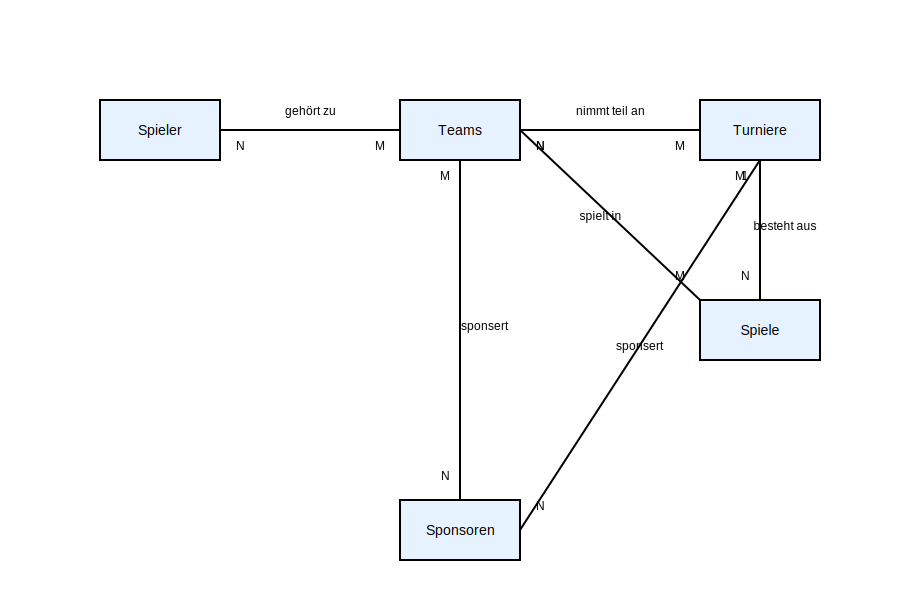
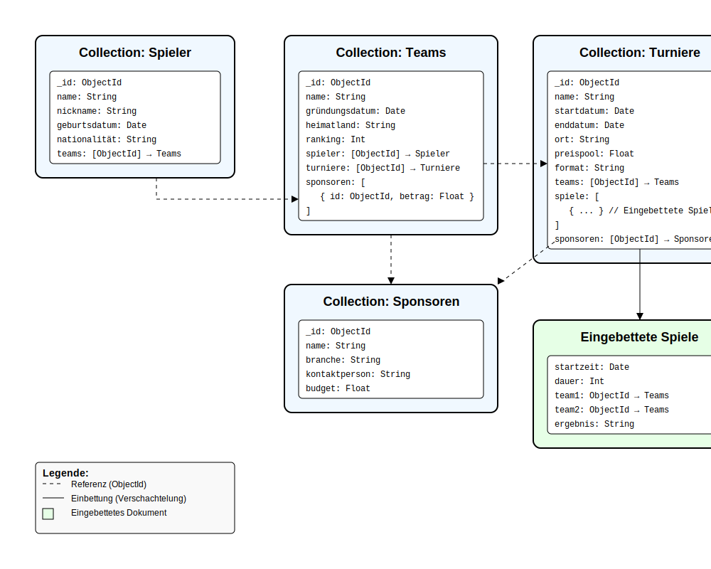

# E-Sport-Turnier-Managementsystem - MongoDB Datenmodellierung

## Übersicht
Dieses Projekt enthält die Datenmodellierung für ein E-Sport-Turnier-Managementsystem mit MongoDB. Es wurde im Rahmen des Kompetenznachweises KN-M-02 "Datenmodellierung für MongoDB" erstellt.

## Inhalt
- Konzeptionelles Datenmodell
- Logisches MongoDB-Datenmodell
- Collection-Erstellungsskript

## A) Konzeptionelles Datenmodell

### Entitäten
1. **Spieler** - Teilnehmer an E-Sport-Wettkämpfen
2. **Teams** - Gruppen von Spielern, die gemeinsam antreten
3. **Turniere** - Veranstaltungen, bei denen Teams gegeneinander antreten
4. **Spiele** - Einzelne Matches innerhalb eines Turniers
5. **Sponsoren** - Unternehmen, die Teams oder Turniere finanziell unterstützen

### Beziehungen
- **Spieler ↔ Teams** (N:M) - Ein Spieler kann in mehreren Teams sein, ein Team besteht aus mehreren Spielern
- **Teams ↔ Turniere** (N:M) - Ein Team kann an mehreren Turnieren teilnehmen, ein Turnier hat mehrere teilnehmende Teams
- **Turniere → Spiele** (1:N) - Ein Turnier besteht aus mehreren Spielen
- **Teams ↔ Spiele** (N:M) - Teams nehmen an Spielen teil
- **Sponsoren ↔ Teams** (N:M) - Ein Sponsor kann mehrere Teams unterstützen, ein Team kann mehrere Sponsoren haben
- **Sponsoren ↔ Turniere** (N:M) - Ein Sponsor kann mehrere Turniere unterstützen, ein Turnier kann mehrere Sponsoren haben

## B) Logisches Modell für MongoDB

Das logische Datenmodell für MongoDB besteht aus folgenden Collections:

1. **spieler**:
   - _id: ObjectId
   - name: String
   - nickname: String
   - geburtsdatum: Date
   - nationalität: String
   - teams: [ObjectId] → Teams

2. **teams**:
   - _id: ObjectId
   - name: String
   - gründungsdatum: Date
   - heimatland: String
   - ranking: Int
   - spieler: [ObjectId] → Spieler
   - turniere: [ObjectId] → Turniere
   - sponsoren: [{ id: ObjectId, betrag: Float }]

3. **turniere**:
   - _id: ObjectId
   - name: String
   - startdatum: Date
   - enddatum: Date
   - ort: String
   - preispool: Float
   - format: String
   - teams: [ObjectId] → Teams
   - spiele: [
     - startzeit: Date
     - dauer: Int
     - team1: ObjectId → Teams
     - team2: ObjectId → Teams
     - ergebnis: String
   - ]
   - sponsoren: [ObjectId] → Sponsoren

4. **sponsoren**:
   - _id: ObjectId
   - name: String
   - branche: String
   - kontaktperson: String
   - budget: Float

 



### Verschachtelungen
- Die **Spiele** werden direkt in den Turnier-Dokumenten eingebettet, da sie nur im Kontext eines Turniers existieren und immer zusammen abgefragt werden.
- Für die N:M-Beziehungen werden Referenzen (ObjectIds) verwendet, teilweise mit zusätzlichen Attributen (wie bei Team-Sponsor-Beziehung).

## C) Anwendung des Schemas in MongoDB

Das folgende JavaScript-Script erstellt die benötigten Collections:

```javascript
// Wechseln zur Datenbank
use EsportTournamentDB;

// Erstellen der Spieler-Collection
db.createCollection("spieler");

// Erstellen der Teams-Collection
db.createCollection("teams");

// Erstellen der Turniere-Collection
db.createCollection("turniere");

// Erstellen der Sponsoren-Collection
db.createCollection("sponsoren");
```