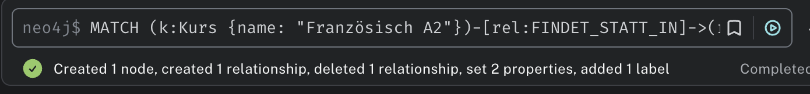

## KN-N-02

### A) Daten hinzufügen

#### 1. Themenwelt: Sprachschule

[Script](sprachschule_datenmodell.cypher)

**Labels (Knotenarten):**

•	Kurs

•	Lehrperson

•	Schueler

•	Raum

**Beziehungen (Kanten):**

•	UNTERRICHTET: Lehrperson → Kurs

•	BELEGT: Schueler → Kurs

•	FINDET_STATT_IN: Kurs → Raum

### B) Daten abfragen

#### 1. Erklärung: Alle Knoten und Kanten lesen

```
MATCH (n)-[r]->(m)
RETURN n, r, m
```


**•	MATCH (n)-[r]->(m):** Findet alle Verbindungen zwischen Knoten.

**•	RETURN n, r, m:** Zeigt alle Knoten und ihre Beziehungen.

**•	OPTIONAL MATCH:** Diese Klausel zeigt auch Knoten ohne Beziehungen. 

**Beispiel:**

```cypher 
MATCH (n:Kurs)
OPTIONAL MATCH (n)-[r]->(m)
RETURN n, r, m
```


#### 2. Szenarien mit Abfragen

##### Szenario 1: Alle Kurse und ihre Räume
Zeige alle Kurse mit zugeordnetem Raum (inkl. Raum-Details).

```
MATCH (k:Kurs)-[:FINDET_STATT_IN]->(r:Raum)
RETURN k.name AS Kursname, r.nummer AS Raum, r.gebaeude AS Gebaeude
```


##### Szenario 2: Schüler:innen in einem bestimmten Kurs
Zeige alle Schüler:innen im Kurs “Englisch A1”.

```
MATCH (s:Schueler)-[:BELEGT]->(k:Kurs)
WHERE k.name = "Englisch A1"
RETURN s.name, s.alter
```


**WHERE-Klausel verwendet**

##### Szenario 3: Lehrpersonen, die keine Kurse unterrichten
Zeige alle Lehrpersonen ohne Zuweisung.

```
MATCH (l:Lehrperson)
OPTIONAL MATCH (l)-[r:UNTERRICHTET]->(k:Kurs)
WHERE r IS NULL
RETURN l.name
```


**OPTIONAL + WHERE IS NULL**

##### Szenario 4: Welche Räume werden für fortgeschrittene Kurse verwendet?

```
MATCH (k:Kurs)-[:FINDET_STATT_IN]->(r:Raum)
WHERE k.niveau = "Fortgeschritten"
RETURN DISTINCT r.nummer, r.gebaeude
```


### C) Daten löschen

**Beispiel-Objekte:**

•	s5 (Schueler Tom)

#### 1. Ohne DETACH DELETE (Fehler bei bestehenden Beziehungen!)

```
MATCH (s:Schueler {name: "Tom"})
DELETE s
```


#### 2. Mit DETACH DELETE

```
MATCH (s:Schueler {name: "Tom"})
DETACH DELETE s
```

 

### D) Daten verändern

##### Szenario 1: Kursdauer ändern

Der Kurs “Deutsch B2” dauert jetzt nur 90 Minuten.

```
MATCH (k:Kurs {name: "Deutsch B2"})
SET k.dauer = 90
```


##### Szenario 2: Lehrperson wechselt Fach

Frau Dubois unterrichtet nun Spanisch.

```
MATCH (l:Lehrperson {name: "Frau Dubois"})
SET l.fach = "Spanisch"
```


##### Szenario 3: Raumnummer eines Kurses ändern

Der Kurs “Französisch A2” findet neu im Raum “203” statt.

```
MATCH (k:Kurs {name: "Französisch A2"})-[rel:FINDET_STATT_IN]->(r:Raum)
DELETE rel

CREATE (newRaum:Raum {nummer: "203", gebaeude: "B"})
CREATE (k)-[:FINDET_STATT_IN]->(newRaum)
```



### E) Zusätzliche Klauseln

#### 1. ORDER BY

**Erklärung:** Sortiert Ergebnisse nach einem Feld (z.B. Name oder Alter).

```
MATCH (s:Schueler)
RETURN s.name, s.alter
ORDER BY s.alter DESC
```
Zeigt alle Schüler:innen sortiert nach Alter absteigend.


#### 2. LIMIT

**Erklärung:** Beschränkt die Anzahl der Ergebnisse.

```
MATCH (s:Schueler)
RETURN s.name, s.alter
ORDER BY s.alter DESC
LIMIT 2
```

